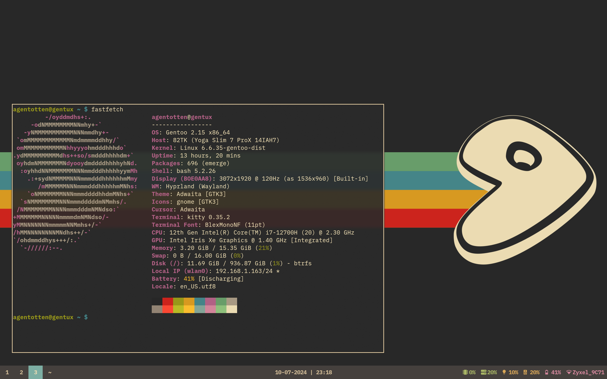
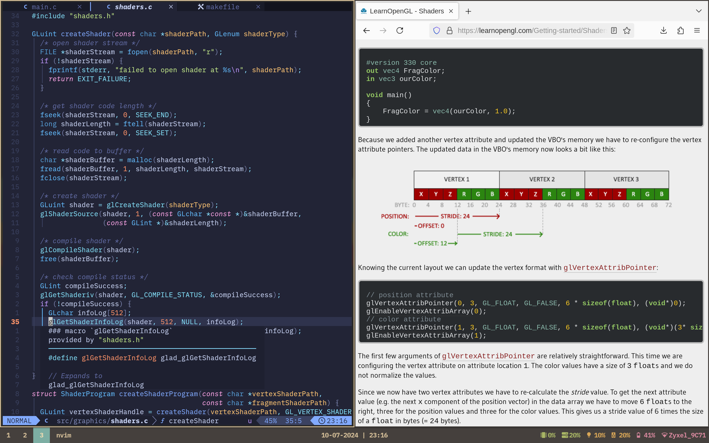

# Agentotten Dotfiles

Dotfiles that I use for my laptop, specifically the Lenovo Slim 7i Pro X

## Essential Package Dependencies

* elogind (systemd)
* hyprcursor
* hypridle
* hyprland
* hyprlock
* hyprpaper
* kitty
* neovim
* pipewire
* waybar

### Fonts

* BlexMono Nerd Font
* LiterationMono Nerd Font
